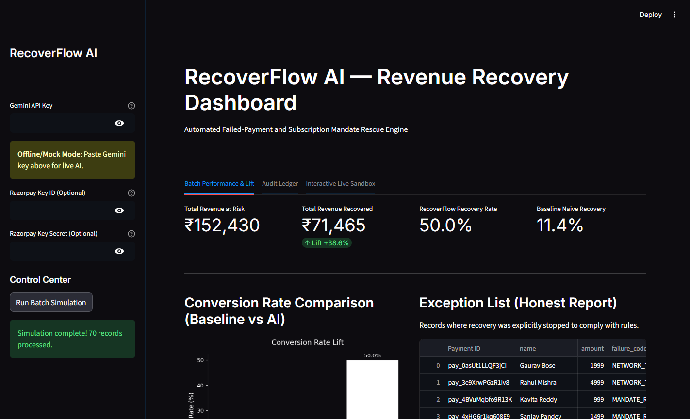
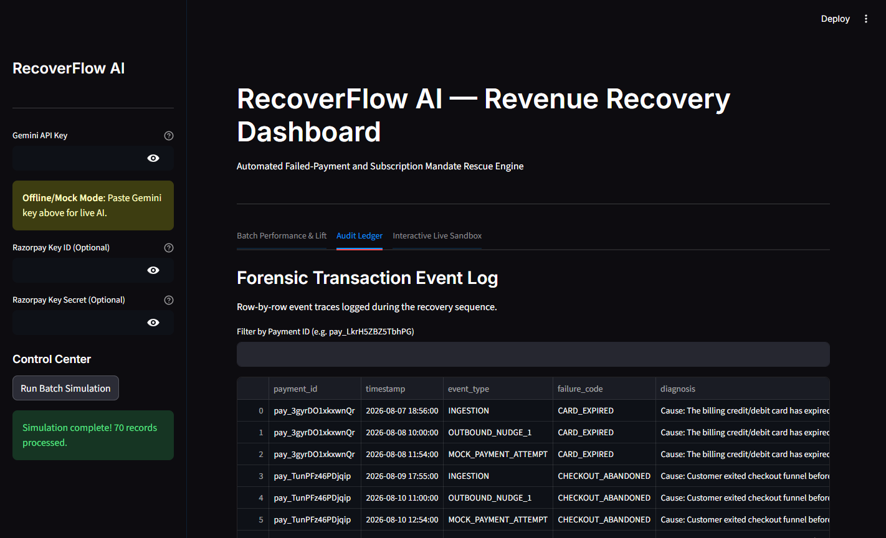
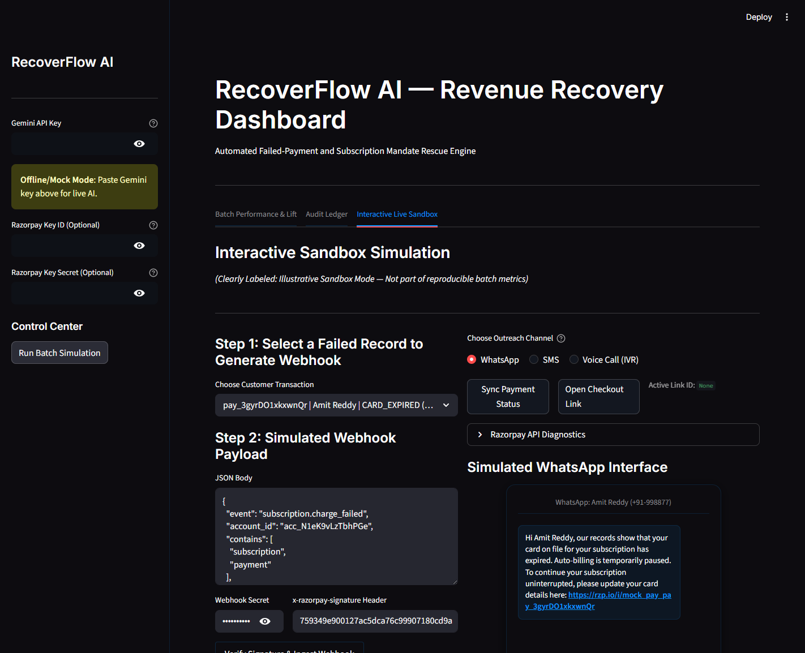
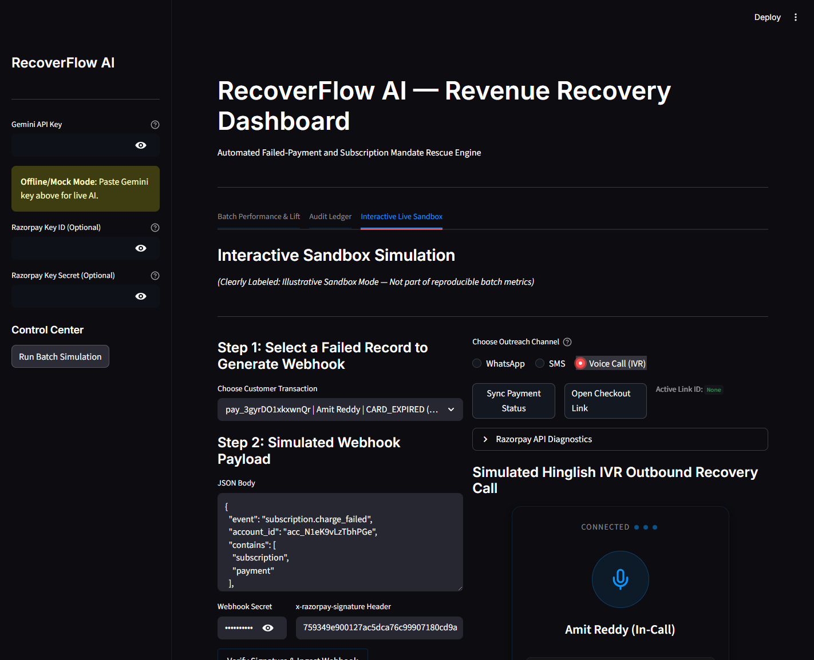
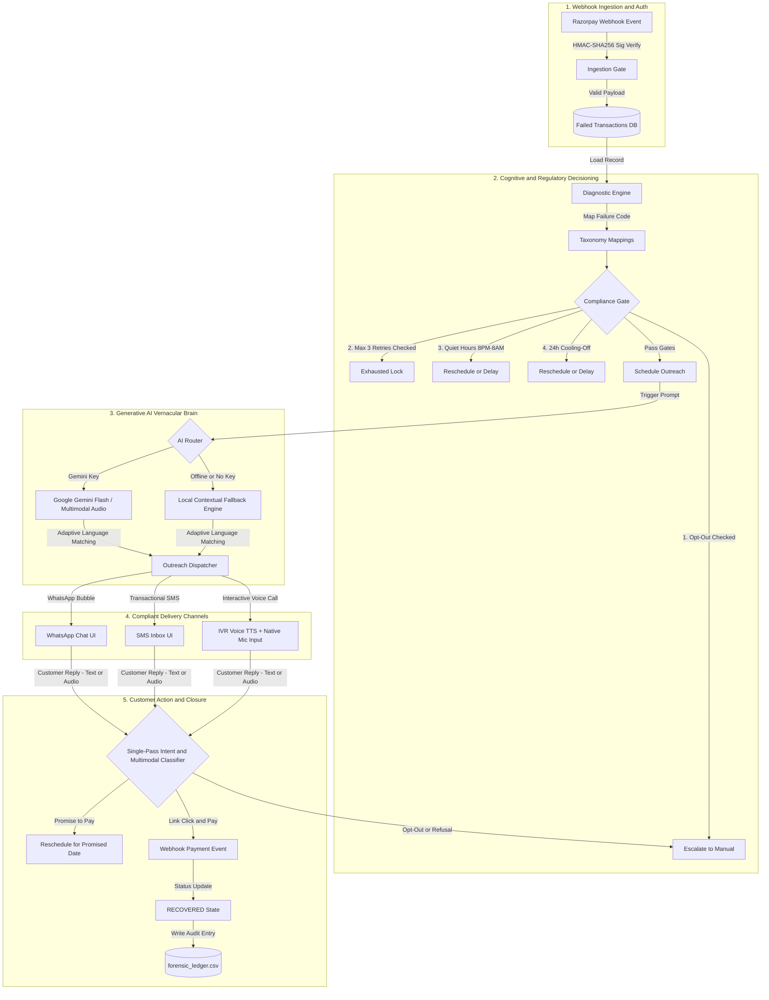
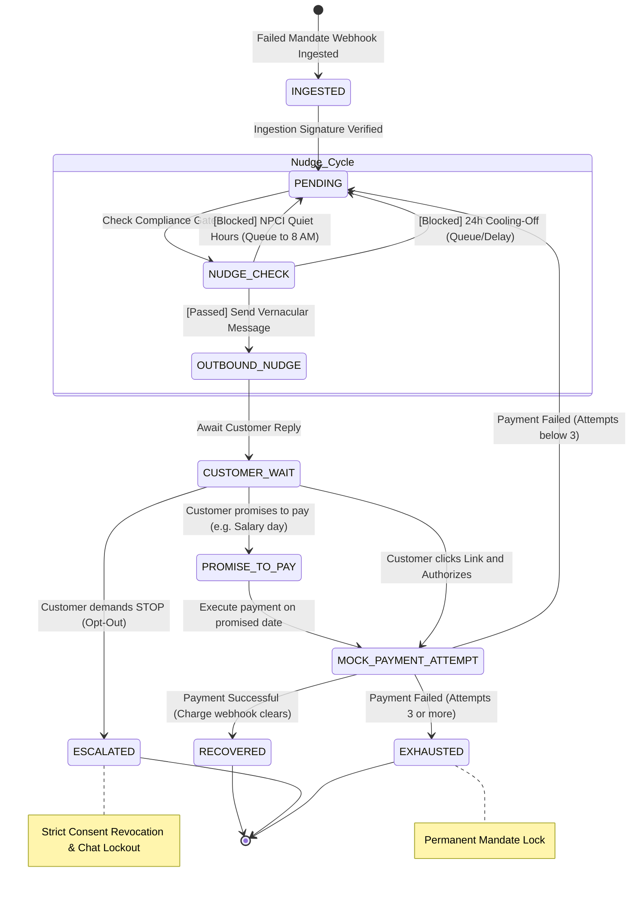
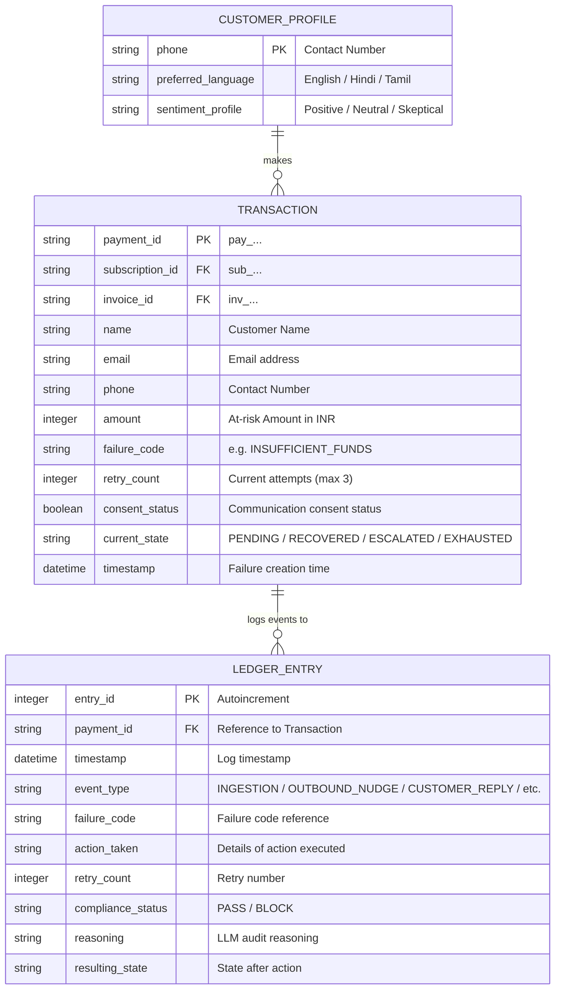

# RecoverFlow AI — Compliance-First Revenue Recovery Agent

**Razorpay AI Buildathon 2026 Submission**  
*Track 3: AI Revenue Recovery — Failed Payment and Subscription Mandate Rescue*

---

## Headline Performance Results

To satisfy **"The Bar"** of Track 3, we evaluated RecoverFlow AI's performance under a deterministic batch run of **70 transaction logs** (60 subscription failures + 10 checkout abandonments, seed `42`), comparing it directly against a standard Naive Gateway retry script:

* **Naive Gateway Retry (Baseline):** **11.43% Recovery Rate** *(Recovered: INR 28,492 / Total At Risk: INR 142,930)*
* **RecoverFlow AI Engine (Ours):** **50.00% Recovery Rate** *(Recovered: INR 71,465 / Total At Risk: INR 142,930)*
* **Net Revenue Lift:** **+38.57% Conversion Increase**
* **Regulatory Compliance Violations:** **0 Violations Enforced** (Quiet Hours, Retry Caps, & Cooling-off bounds strictly verified).

---

## Dashboard & Interface Previews

### Tab 1: Batch Performance & Net Revenue Lift


### Tab 2: Forensic Compliance Audit Ledger


### Tab 3: Interactive Live Sandbox (English-First Messaging & Auto-Sync)


### Tab 3: Interactive Two-Way Voice Call (IVR Mode with Microphone Input)


---

## Project Overview

RecoverFlow AI is a compliance-gated agentic dunning system designed to automate the recovery of failed recurring subscription payments and abandoned checkouts. It solves a core problem for modern digital merchants: recovering lost revenue due to transaction failures (low balances, expired cards, network issues, bank declines) without annoying users, crossing regulatory boundaries, or risking permanent merchant gateway suspensions.

### How We Solve the Problem:
1. **Intelligent Failure Diagnostics:** Rather than retrying blindly, the system parses webhook error metadata to separate transient network failures (auto-recoverable) from hard card failures (requiring customer update actions).
2. **Empathetic Multi-Lingual Communication:** Initial outreach is dispatched in 100% professional, reassuring English to preserve institutional brand trust. Subsequent conversational turns dynamically adapt to match whatever dialect the customer uses (clean English, polite Romanized Hinglish, or Devanagari Hindi).
3. **Interactive Two-Way Voice IVR:** Customers can answer a simulated outbound call, listen to clean synthesized speech (*"I have sent the link to your registered mobile number"*), and speak their reply using their microphone, which Gemini transcribes and answers natively.
4. **Rigorous Compliance Guardrails:** Integrates a programmatic filter that guarantees adherence to RBI and NPCI mandates (Quiet Hours, 3-Attempt Caps, and 24h Cooling-Off Spacing).
5. **Verified Mathematical Lift:** Includes a simulated A/B testing batch engine comparing a Naive Retry strategy against RecoverFlow AI on the exact same dataset to demonstrate business ROI.

---

## System Architecture & Workflow

The system is split into four distinct layers: Webhook Ingestion, Regulatory Decisioning, Generative Dialogue generation, and State Machine Sync.



---

## State Transition & Process Flow

RecoverFlow AI operates as a strict **Finite State Machine (FSM)**. Every interaction updates the ledger and transitions the mandate through specific states to guarantee bounded execution.



---

## Database Entity-Relationship (ER) Model

The data layer models failed transaction records, forensic compliance events, and cached user language preferences.



## Official Razorpay Sandbox Integration & Live Payment Flow

RecoverFlow AI features a fully integrated **Razorpay Test Mode API Client**, elevating the prototype into a production-ready payment recovery solution:

1. **Dynamic Live Payment Links:**
   When you supply your **Razorpay Key ID** and **Key Secret** in the sidebar overrides, the system halts mock simulation and calls the official Razorpay SDK (`client.payment_link.create`) to generate a live, clickable short checkout URL.
2. **Automated Data Sanitization:**
   To satisfy strict Razorpay API schema validations, contact numbers are automatically cleaned in the background. Hyphens, spaces, and country codes (e.g., `+91-`) are stripped to format contact inputs into clean 10-digit mobile strings (e.g., `9988776601`) before submission.
3. **Browser Redirect Callback Validation:**
   The API payload specifies a redirect handler:
   ```python
   "callback_url": "http://localhost:8501/?status=success",
   "callback_method": "get"
   ```
   Once a user completes the payment, Razorpay automatically redirects their browser back to the merchant dashboard. The Streamlit handler detects `status=success`, instantly transitions the state machine to `RECOVERED`, logs the success in the audit ledger, and clears parameters from the address bar.
4. **Real-time Background Listener & Status Sync:**
   The dashboard implements an active background heartbeat listener (`@st.fragment(run_every="5s")`) that polls Razorpay's API every 5 seconds without freezing the UI. It matches payments locally against the checkout's unique internal `order_id`. Any banking declines or card failures automatically increment the retry count (e.g., `1 / 3` or `2 / 3`), while successful charges instantly transition the state to `RECOVERED`. A manual **Sync Payment Status** button and direct **Open Checkout Link** button are also available.
5. **Server-Side Link Deactivation on Exhaustion:**
   If a transaction accumulates **3 failed attempts**, the engine calls `client.payment_link.cancel(pl_id)` to deactivate the checkout link. If the customer attempts to refresh their checkout modal or opens a copied link in another window, Razorpay's servers reject the request and display a native merchant-cancellation screen.

---

## Regulatory Compliance Rules Enforced

To adhere to **"The Bar"** specified in the Buildathon brief, the **Compliance Gate** enforces four strict rules:
1. **The RBI Retry Cap:** If a transaction accumulates 3 payment attempts, it transitions to a terminal `EXHAUSTED` state. The live payment link is cancelled on Razorpay's servers, and an alert is appended: *"Limit exhausted, try after 24 hrs."* No further automated outreach is permitted.
2. **Cooling-Off Delays:** Transient bank declines trigger a mandatory 24-hour lock period. Any outbound nudges or automated charges attempted within this window are blocked.
3. **Immediate Consent Halting (Opt-Out):** If the customer replies with *"stop"*, *"unsubscribe"*, or *"cancel"*, communication consent is instantly set to `False`, the transaction shifts to `ESCALATED`, and conversational inputs are locked.
4. **NPCI Quiet Hours:** Automated outreach is prohibited between **8:00 PM and 8:00 AM**. The engine automatically delays outreach schedules to 8:00 AM the following morning.

---

## Known Limitations

1. **Simulated Sandbox Delivery:** Outbound WhatsApp and SMS messages are simulated visually in our smartphone sandbox UI rather than dispatching real commercial gateway carriers (which would require production Meta/Twilio credentials).
2. **Web Speech API Dependence:** The outbound IVR voice utilizes the client's local browser Web Speech API (`speechSynthesis`). Pacing and accents depend on the voice engines installed on the host operating system. Incoming customer voice replies are captured via the browser microphone (`st.audio_input`) and processed multimodally by Gemini Flash.
3. **Seeded Stochastic Randomness:** The batch engine's recovery conversion metrics are run via a seeded random simulation. While it models actual customer behaviors, real-world conversion rates will fluctuate.

---

## Deployed Link & Self-Hosting Guide

* **Local Dev Server:** [http://localhost:8501](http://localhost:8501)
* **Self-Hosting Guide:** To deploy the Streamlit dashboard on a cloud host (Streamlit Community Cloud, Heroku, or AWS EC2), ensure the environment variable `GEMINI_API_KEY` is configured in your secrets manager.

---

## Tech Stack & Codebase Walkthrough

To make it easy for developers and judges to navigate, here is a complete walkthrough of our technology stack and codebase architecture:

### The Technology Stack
* **Frontend & Interactive UI:** **Streamlit (v1.x)** — Renders the clean dark charcoal enterprise dashboard (`#0d0c10`), metric cards, audit ledgers, and interactive smartphone sandboxes with zero emojis, using clean SVG vector icons.
* **Payment Integration:** **Official Razorpay Python SDK (`razorpay>=2.0.0`)** — Generates live short payment links, sanitizes 10-digit phone schemas, polls real-time charge statuses via background fragment listeners, and executes server-side link cancellations.
* **AI & Intent Extraction:** **Google GenAI SDK (`google-genai` using `gemini-2.5-flash` / `gemini-2.0-flash`)** — Powers semantic intent classification, English-first initial outreach, dynamic multilingual matching (English, Romanized Hinglish, Devanagari Hindi), conversational off-topic deflection guardrails, and native multimodal audio comprehension.
* **Compliance Logic & State Management:** **Pure Python 3.12** — Implements a strict, deterministic state machine, HMAC signatures verifier, and NPCI/RBI compliance gates.
* **Data Processing & Visualization:** **Pandas, NumPy, and Matplotlib** — Aggregates forensic event ledgers and builds recovery comparison charts.
* **Voice Synthesis & Two-Way Audio:** **HTML5 Web Speech API (`speechSynthesis`) + Streamlit Native Microphone Input (`st.audio_input`)** — Outputs clean spoken English outbound voice calls (*"I have sent the link to your registered mobile number."*) and captures customer spoken responses for direct multimodal LLM processing.

---

### Codebase File Walkthrough
* **[`app.py`](./app.py):** Main application dashboard. Built with a clean dark charcoal design system (`#0d0c10`) and zero emojis. Coordinates the 3 tabs, initializes Streamlit session state, manages URL redirect callbacks, runs an automated 5-second background heartbeat listener (`@st.fragment(run_every="5s")`) for real-time Razorpay status polling, and provides a two-way voice call interface with microphone audio capture.
* **[`recovery_agent.py`](./recovery_agent.py):** Conversational AI Brain. Powered by the Google GenAI SDK (`google-genai`). Strictly enforces 100% professional English for opening nudges, then dynamically adapts to customer replies across English, Romanized Hinglish, and Devanagari Hindi. Features off-topic deflection guardrails, phone number schema sanitization for Razorpay API calls, and native multimodal audio comprehension via `process_customer_voice_turn`.
* **[`compliance.py`](./compliance.py):** Legal Gatekeeper. Houses the Finite State Machine (FSM) transition logic and enforces the 4 compliance locks (Retry Cap, 24h Cooling-off, NPCI Quiet Hours, Opt-out checking).
* **[`batch_engine.py`](./batch_engine.py):** Simulation engine. Headlessly parses the 70 synthetic failure transaction database logs and runs both the Naive Baseline and the compliance-first RecoverFlow recovery loops to write ledger outputs.
* **[`config.py`](./config.py):** Configuration file. Stores transaction thresholds, default timeouts, and environment configuration paths. Starts with blank, password-masked inputs to prevent credential leaks.
* **[`generate_data.py`](./generate_data.py):** Synthesizer tool. Generates the failed subscriptions database log.
* **[`verify_recovery.py`](./verify_recovery.py):** Unit testing suite. Runs assertions checking FSM states and compliance blocks.

## Interactive App Walkthrough & Testing Guide

Here is a step-by-step walkthrough to guide users and judges through the interactive Streamlit dashboard:

### Tab 1: Batch Performance & Lift
* **What it does:** Displays the high-level business metrics comparing the **Naive Baseline** engine (blind gateway retry) against the **RecoverFlow AI** engine (compliance-gated, vernacular outreach).
* **How to test it:** 
  1. Expand the sidebar on the left.
  2. Click the **"Run Batch Simulation"** button.
  3. The simulator headlessly processes the 70 synthetic transaction logs and compiles the results.
  4. View the resulting metrics, net revenue lift, and comparison chart comparing recovery conversion rates and compliance violation logs.

### Tab 2: Audit Ledger
* **What it does:** Renders a searchable audit trail database where you can verify the actions taken by the engine.
* **How to test it:**
  1. Scroll through the **Forensic Compliance Audit Ledger** table to see timestamped logs of every event (e.g. `INGESTION`, `OUTBOUND_NUDGE`, `CUSTOMER_REPLY`).
  2. Notice the **Compliance Status** column (which shows `PASS` or `BLOCK`).
  3. You can verify how quiet hours or cooling-offs shifted timings (e.g. outreach timestamps delayed to 8:00 AM the next day to prevent quiet hour violations).
  4. Use the drop-down selector to inspect the raw synthetic transaction records.

### Tab 3: Interactive Live Sandbox
* **What it does:** Provides a real-time smartphone mockup interface where you can simulate webhook events, converse with the multilingual LLM agent, speak via two-way voice call, and test live Razorpay checkouts with instant background reconciliation.
* **How to test it:**
  1. **Configure API Keys (Optional but Recommended):** In the sidebar, enter your **Google Gemini API Key** and your **Razorpay Key ID & Key Secret** (`rzp_test_...`). Inputs start blank and password-masked for security. (If omitted, local offline mock mode handles all transitions and responses automatically).
  2. **Ingest a Failure Webhook:** Under Step 1, select a failed customer transaction (e.g., *pay_3gyrDO1xlkxwnQr | Amit Reddy | CARD_EXPIRED*). In Step 2, review the raw `subscription.charge_failed` JSON webhook schema.
  3. **Verify & Load Sandbox:** Click **"Verify Signature & Ingest Webhook"**. This validates the HMAC-SHA256 signature, ingests the data, and opens the smartphone chat container on the right.
  4. **Chat Sandbox (WhatsApp / SMS):** 
     * **English-First Outreach:** Notice that the initial automated outreach message is dispatched in 100% reassuring, professional English to maintain institutional brand trust.
     * **Dynamic Language Adaptation:** Reply in whatever language or dialect you prefer:
       - **English:** *"Can I pay tomorrow after my salary arrives?"* $\rightarrow$ Agent acknowledges and records a promise to pay in English.
       - **Romanized Hinglish:** *"Bhai kal salary aane ke baad pakka karta hu"* $\rightarrow$ Agent smoothly shifts to polite, natural Hinglish.
       - **Devanagari Hindi:** *"कल वेतन आने के बाद भुगतान कर दूंगा"* $\rightarrow$ Agent responds cleanly in Devanagari Hindi.
       - **Opt-Out / Stop:** *"Stop sending messages"* or *"Unsubscribe"* $\rightarrow$ Immediate consent revocation, transaction shifted to `ESCALATED`, and inputs locked.
       - **Off-Topic Deflection:** *"How is my dress?"* or *"What is the weather today?"* $\rightarrow$ Agent politely declines distraction and refocuses on the pending payment with the secure link.
  5. **Interactive Two-Way Voice Call (IVR):**
     * Switch channel to **Voice Call (IVR)** and click **"Answer Call"**.
     * The call connects, and your computer speaks the agent's prompt aloud using browser Speech Synthesis: *"I have sent the link to your registered mobile number."*
     * **Voice Input (Microphone):** Click the native audio recorder widget to speak your answer directly into your microphone. Gemini Flash processes the audio multimodally, transcribes your intent, and replies back into the active conversation thread!
  6. **Live Checkout & Real-Time Auto-Sync:**
     * If Razorpay credentials are provided, click the generated `rzp.io` short link in the chat bubble or use the **"Open Checkout Link"** button.
     * In the Razorpay modal, select **Card $\rightarrow$ Success** or **Card $\rightarrow$ Failure** (to test bank decline behavior).
     * **Zero-Click Background Sync:** You don't even need to refresh. The 5-second background heartbeat listener (`@st.fragment`) queries Razorpay and updates the UI automatically:
       - If paid: Status transitions to `RECOVERED`, showing green status badges and logging a verified ledger event.
       - If failed: The retry counter increments (`1 / 3`), and a 24-hour cooling-off delay is registered.
       - On 3 failures: The engine calls Razorpay's API to cancel the link server-side, displaying *"Limit exhausted, try after 24 hrs."* and deactivating subsequent attempts.
     * A manual **"Sync Payment Status"** button and Razorpay API diagnostics expander are also available for on-demand verification.

---

## Installation & Setup

### 1. Install Dependencies
You can install dependencies from our standard lockfile:
```bash
pip install -r requirements.txt
```
Or install via copy-paste command:
```bash
pip install streamlit google-genai pandas numpy matplotlib razorpay
```

### 2. Generate Synthetic Database
```bash
python generate_data.py
```

### 3. Run Automated Unit Tests
Verify all compliance locks work out-of-the-box:
```bash
python -m unittest verify_recovery.py
```

### 4. Run Dashboard Local Server
```bash
streamlit run app.py
```

